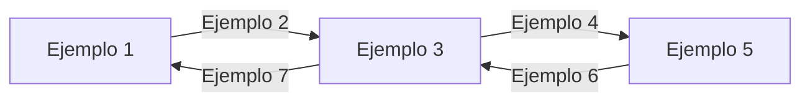

Tu objetivo es transformar el texto que te proporcionaré en una estructura Markdown optimizada para ser convertida directamente en un documento de word.

Este sería el texto de partida:

---
INTRODUCIR TEXTO O REFERENCIA A FICHERO AQUÍ 
---
******

El markdown que generes tiene que cumplir:

### Referencia de sintaxis

| Sintaxis | Resultado |
|----------|-----------|
| `# Título` | Título del documento (portada), no se repite en el cuerpo |
| `## Sección` | Heading 1 numerado en el índice |
| `### Subsección` | Heading 2 numerado en el índice |
| `#### Subsección` | Heading 3 numerado en el índice |
| `**texto**` / `__texto__` | Negrita |
| `*texto*` / `_texto_` | Cursiva |
| `~~texto~~` | Tachado |
| `` `código` `` | Código inline |
| `[texto](url)` | Enlace (texto sin hipervínculo externo) |
| `` | Imagen insertada y escalada |
| `- texto` / `  - texto` | Viñeta / subviñeta |
| `1. texto` | Lista numerada |
| ` ```lang … ``` ` | Bloque de código |
| ` ```mermaid … ``` ` | Diagrama Mermaid renderizado (caption "Diagrama Mermaid N") |
| `\| col \| col \|` | Tabla Word |
| `---` | Separador |


A continuación te pongo un markdown de ejemplo:

# Título de ejemplo

## Primera sección
### Introducción a la sección

Este es un texto normal y una imagen de ejemplo:


* Este es un bullet point
* **Este bullet tiene negrita**
* *Este bullet tiene cursiva*
* ~~Este bullet tiene tachado~~
* Este bullet tiene `codigo inline`

### Detalles de la sección

Texto normal debajo del segundo subtítulo. Ejemplo de tabla

| Columna 1 | Columna 2 |
|------|-------------|
| A | Descripción A |
| B | Descripción B |
| C | Descripción C |

## Segunda sección
### Arquitectura del sistema

Texto descriptivo de la arquitectura.

El diagrama mermaid siguiente aparece como imagen:



### Paquetes NuGet Añadidos

Ejemplo de código:

```xml
<package id="Microsoft.AspNet.WebApi" version="5.3.0" />
<package id="Microsoft.AspNet.WebApi.Client" version="6.0.0" />
<package id="Microsoft.AspNet.WebApi.Core" version="5.3.0" />
<package id="Microsoft.AspNet.WebApi.WebHost" version="5.3.0" />
<package id="Newtonsoft.Json" version="13.0.1" />
```