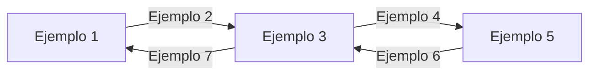

# Título de la presentación de ejemplo

## Primera sección
### Introducción a la sección

Este es un texto normal dentro de la primera slide de contenido.
Aquí puede haber varias líneas de texto.

* Este es un bullet point
* **Este bullet tiene negrita**
* *Este bullet tiene cursiva*
* ~~Este bullet tiene tachado~~
* Este bullet tiene `codigo inline`

### Detalles de la sección

Texto normal debajo del segundo subtítulo.

* Otro bullet en la segunda slide de esta sección
* Con **palabras en negrita** y *palabras en cursiva* mezcladas

Debajo de los bullets puede haber más texto normal.

## Segunda sección
### Arquitectura del sistema

Texto descriptivo de la arquitectura.

El diagrama mermaid siguiente aparece como imagen:

### Flujo de datos

* Paso 1: El cliente envía la solicitud
* Paso 2: La solicitud se procesa
* Paso 3: Se consulta la base de datos
* Paso 4: Se devuelve la respuesta

Nota: los pasos anteriores pueden variar.

## Tercera sección

Esta sección no tiene subtítulos H3, solo bullets y texto.

Texto introductorio de la tercera sección.

* Objetivo 1: Automatizar el proceso
* Objetivo 2: Reducir tiempos de entrega
* Objetivo 3: Mejorar la calidad

Texto de cierre de la sección con **énfasis** en puntos clave.
